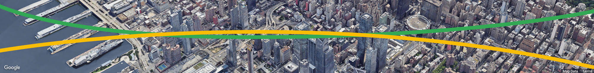
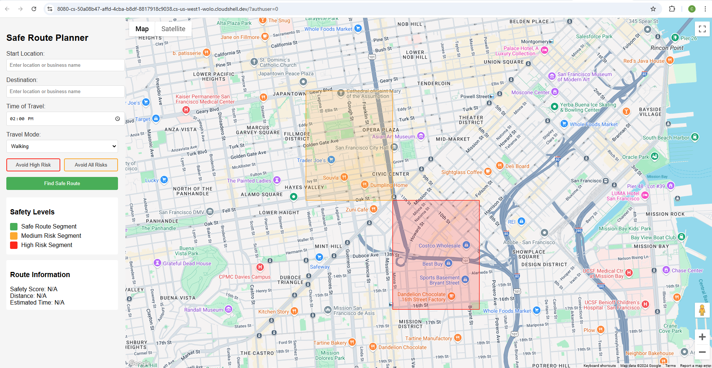
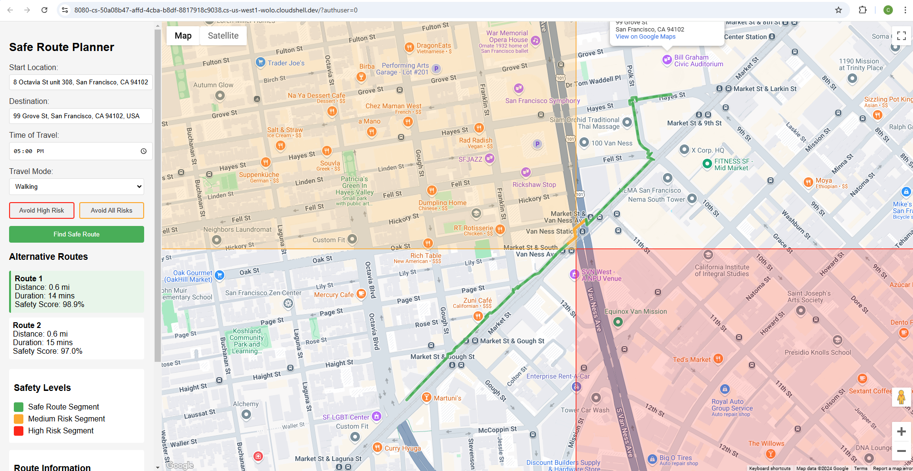
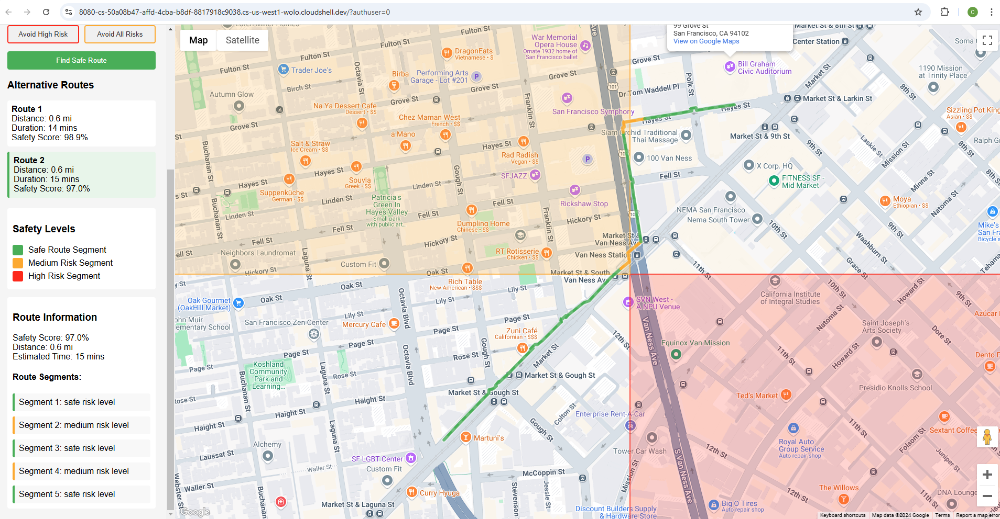
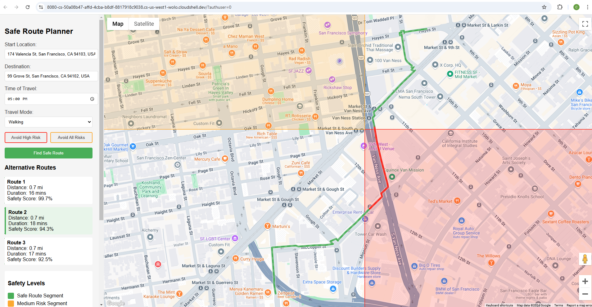
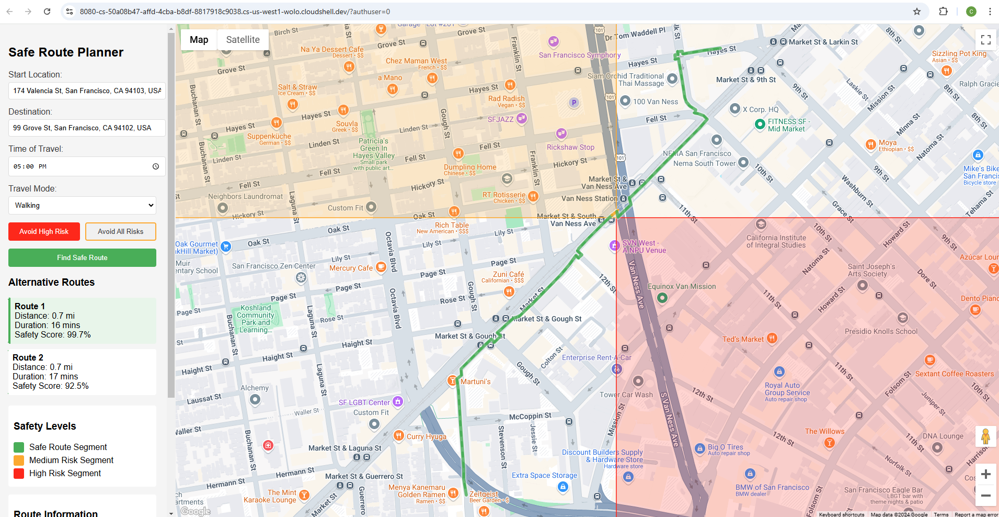
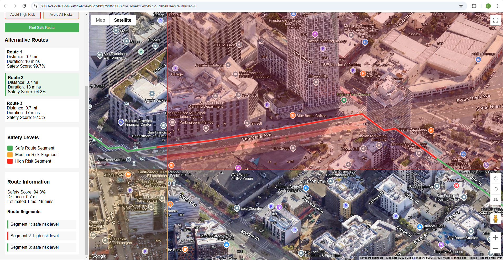
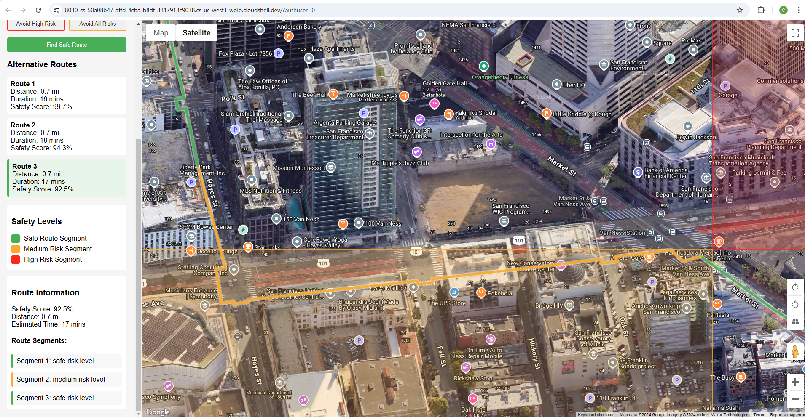

# SafeRoute: Reimagining Urban Navigation Through Safety and Immersion

**Author:** Chunming Peng

**GitHub:** https://github.com/PGCHM/SafeRoute.git

**Banner Image Credit:** [Google Photorealistic 3D Maps Challenge](https://google3dmaps.devpost.com/)

## Project Overview

SafeRoute is an innovative web application that transforms urban navigation by prioritizing personal safety through advanced geospatial technology and data visualization. By leveraging Google Maps Platform Photorealistic 3D Maps, our solution goes beyond traditional route planning, offering users a comprehensive, immersive experience that helps them navigate cities with confidence and security. This project aims to design and implement a safety-focused route planner that visualizes danger zones in a specific time of day (like areas with high crime rates) and finds safer routes to avoid the danger zones as much as possible. 

## Inspiration and Problem Statement

Urban safety remains a critical concern for many individuals, particularly in large metropolitan areas. Existing navigation tools primarily focus on distance and time, overlooking crucial safety considerations. SafeRoute addresses this gap by:
  - Integrating real-time crime data
  - Visualizing potential danger zones
  - Calculating safety scores, and risk scores
  - Dynamically routing users through safer paths
  - Providing an immersive, interactive experience

## Technical Implementation
### Core Features

1. Safety-Driven Route Planning
   - Incorporates historical crime data and real-time safety indicators
   - Dynamically calculates routes that minimize exposure to high-risk areas
   - Adapts recommendations based on time of day and current urban conditions

2. Photorealistic 3D Visualization
   - Utilizes Google Maps Platform Photorealistic 3D Maps to create an immersive navigation experience
   - Renders danger zones with semi-transparent polygons in varying intensity colors
   - Provides realistic urban context that enhances user understanding of their environment

3. Gamification Elements
   - Safety Score: Users earn points for choosing safer routes
   - Risk Visualization: Color-coded danger zones with interactive tooltips
   - Personalized safety recommendations based on user preferences and historical data

### Technical Stack
   - Frontend: React.js
   - Development: Google Cloud Shell Scripter 
   - Mapping: Google Maps JavaScript API
   - 3D Rendering: Google Maps Platform Photorealistic 3D Maps
   - Data Integration: Crime API, Geospatial Data Services

### AI and Geospatial Integration
SafeRoute demonstrates advanced AI and geospatial capabilities through:
   - Real-time route optimization
   - Contextual safety recommendations
   - Adaptive routing based on user feedback and historical data
   - Machine learning algorithms for danger zone prediction (to do)

### Key Google Maps Platform Integrations

1. Photorealistic 3D Maps
   - Enables hyper-realistic urban environment rendering
   - Provides depth and context to safety visualizations
   - Allows users to understand route characteristics beyond traditional 2D maps

2. Places API

   - Identifies and annotates points of interest
   - Enhances route recommendations with contextual safety information

## Detailed implementations
This implementation includes several safety-focused features:

1. Safety Features:
- Visualization of high and medium risk areas
- Route calculation that avoids dangerous areas
- `Safety score` for each route
- `Time-based warnings for late night travel`
- Alternative route suggestions
- Real-time safety information

2. Interactive Elements:
- Address autocomplete
- Time of day selection
- Travel mode options (walking/transit)
- Interactive map with danger zones
- Clear safety information display

3. Safety Calculations:
- `Risk score` calculation based on proximity to danger zones
- Route optimization for safety
- `Time-based risk assessment`
- Distance and duration estimates

Note: This is a simplified example using mock data for danger zones - in a real implementation, it's desired to use actual crime statistics data from reliable sources.

To use this implementation:

1. Replace `YOUR_API_KEY` with your Google Maps API key in the `.env` and `index.html` files
2. Enable these APIs in Google Cloud Console:
   - Maps JavaScript API
   - Places API
   - Directions API, and Directions Matrix API
   - Geocoding Library
3. The code has been tested and run in Google Shell Editor. You would need to initiaze the environment through:
   - `npm i`
   - `npm start -- --port=8080`
4. Then preview the website through the preview window, e.g., at `https://8080-<instance id>.cs-us-west1-wolo.cloudshell.dev/?authuser=0&redirectedPreviously=true`

The starting UI looks like

## UI friendliness

There are significant improvements to the Safe Route Planner:

1. Enhanced Location Input:
   - Added full Places Autocomplete support for both start and destination fields
   - Users can now enter business names, landmarks, or addresses
   - Added validation to ensure selected locations are valid
   - Improved place search with both establishments and geocoded locations

2. Route Visualization:
   - Routes are now color-coded based on risk level:
      - Green: Safe segments
      - Orange: Medium risk segments
      - Red: High risk segments
   - Each segment is drawn as a separate polyline with appropriate coloring
   - Added a new route segments panel showing the risk level of each segment

3. Highlighting Effects:
   - Added a glowing effect to routes (Routes now have a white outline for better contrast)
   - Created a shadow effect for better visibility (Increased visibility with drop shadows)
   - Implemented hover interactions
   - Added animated dash effects along the route (Smooth animations for user interactions)
   - Different highlighting for different risk levels

4. UI Improvements:
   - Updated the legend to match the new route visualization
   - Added route segments information in the sidebar
   - Improved input placeholders to clarify that business names can be used
   - Added better error handling and user feedback

5. Interactive Features:
   - Routes highlight on hover
   - Animated dashes show direction of travel
   - Increased visibility when interacting with route segments

6. Performance Considerations:

   - Optimized animation timing
   - Efficient use of Google Maps polyline features
   - Proper z-indexing for overlapping elements
   

7. Technical Improvements:
   - Better segment detection and risk assessment
   - Improved bounds handling to show the entire route
   - Enhanced autocomplete configuration with specific fields and types
   - Better error handling for invalid locations

We can input the starting and ending locations, and select what time of the day we are traveling, and then click the `Find Safe Route` button.

There could be more than one optimized route; click on alternative route to see the differences in details (route visualization, safety scores, and road segment variances).

## Enhanced functionalities 

Focused on finding alternative routes, I have made these enhancements

1.	Added Risk Avoidance Controls:
   - New toggle buttons for avoiding high-risk and all-risk areas
   - Visual feedback for active avoidance settings
   - Logical coupling between the buttons (avoiding medium risk automatically avoids high risk)

2.	Enhanced Route Finding:
   - Routes are now filtered based on risk avoidance settings
   - Multiple alternative routes are generated and analyzed
   - Each route is scored based on risk levels
   - Routes that violate avoidance settings are filtered out

3.	Alternative Routes Display:
   - Added a new section showing alternative routes
   - Each alternative shows distance, duration, and safety score
   - Routes can be selected to view on the map
   - Selected route is highlighted in the list

4.	Visual Improvements:
   - Color-coded buttons matching risk levels
   - Active state styling for avoidance toggles
   - Clear visual hierarchy for route alternatives
   - Interactive route selection
   
   
## Key tech improvements and explanations

The key improvements on the technical side contains:

   - Click Listener: A click event listener is attached to each segmentDiv within the updateSafetyInfo function. This ensures that when a segment description is clicked, the associated code executes.
   - LatLngBounds: Inside the click listener, a LatLngBounds object is created. This object defines a rectangular area on the map. We extend the bounds to include all the points within the clicked segment.
   - map.fitBounds(): The map.fitBounds(bounds) function is used to re-center and zoom the map so that the entire LatLngBounds (i.e., the clicked segment) is visible.
   - Conditional 3D View: Added conditional 3D view based on the segmentLength. If the segment is shorter than a defined threshold (5km in the example), 3D is enabled. Adjust the threshold as you see fit for your application.
   - map.setTilt() and map.setHeading(): Inside the conditional, map.setTilt() applies a tilt to the map view, creating the 3D perspective. Experiment with values between 0 (flat) and 90 (maximum tilt). map.setHeading() can rotate the map for optimal viewing. You can set this to be dynamic based on the orientation of the line segment for more advanced behaviour.

With these changes, clicking on a route segment will now center and zoom to that segment, and for shorter segments also enable a 3D view. This allows for more detailed inspection of particular parts of the route.

We can also click on `Avoid High Risk` or `Avoid All Risks` buttons to enable routing with restrictions. For example, if we do not enable `avoid high risk`, then there would be three optimized routes as listed:

Once `Avoid High Risk` is enabled, the 2nd route in the results pane would not be shown any more, and we are only seeing two optimized routes (since the 2nd route contains segments inside high risk areas):

We can also look at `Route Information` to check details of the road segments. Clicking on an individual segment would trigger the 3d perspective of the map, and zoom right into the specific road segment. For isntance, clicking on the high risk segment of Route 2, the user's view would be shifted to:

Or clicking on the medium risk segment of Route 3, user will be redirected to the details of:

## Future Enhancements

To enhance this further, I plan to add these features:

1. Add real crime data integration:
   - Police department APIs
   - Crime statistics databases
   - Real-time incident reports

2. Add safety features:
   - Emergency contact integration
   - Live location sharing
   - Well-lit route preferences
   - Public area preferences

3. Enhance time-based features:
   - Historical crime data by time
   - Business hours along route
   - Public transit schedules

4. Add community features:
   - User-reported incidents
   - Safe haven locations
   - Community ratings for areas
   - Crowdsourced safety updates
   
5. Implement machine learning for more accurate predictions

6. Develop mobile application version

To use this enhanced version:
   - Click "Avoid High Risk" to skip routes with high-risk segments
   - Click "Avoid All Risks" to find routes that avoid both medium and high-risk areas
   - View alternative routes in the sidebar
   - Click on different routes to view them on the map

## Conclusions
SafeRoute represents a paradigm shift in urban navigation, transforming how individuals perceive and interact with city environments. By combining cutting-edge geospatial technology, data visualization, and user-centric design, we've created a solution that empowers users to make informed, safety-conscious travel decisions.

Technologies Used:
 - Google Maps Platform Photorealistic 3D Maps
 - Google Maps JavaScript API
 - React.js
 - Machine Learning Algorithms
 - Geospatial Data Services

## References

Google Maps Samples, https://github.com/googlemaps-samples/codelab-route-planner-101-js/tree/main

Google Maps JS Services, https://github.com/googlemaps/google-maps-services-js/tree/master

**Author:** Chunming Peng

**GitHub:** https://github.com/PGCHM/SafeRoute.git

**Footnote Image Credit:** [Google Photorealistic 3D Maps Challenge](https://google3dmaps.devpost.com/)

